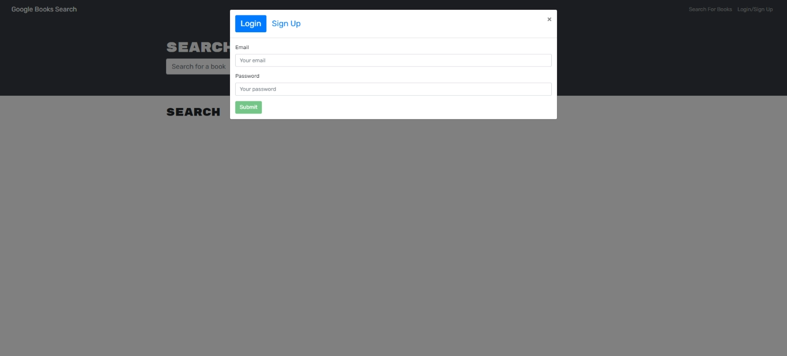
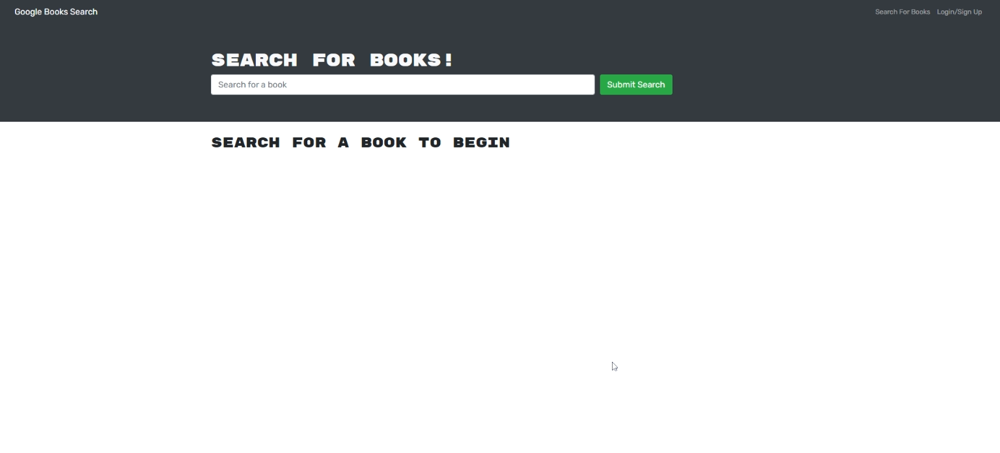
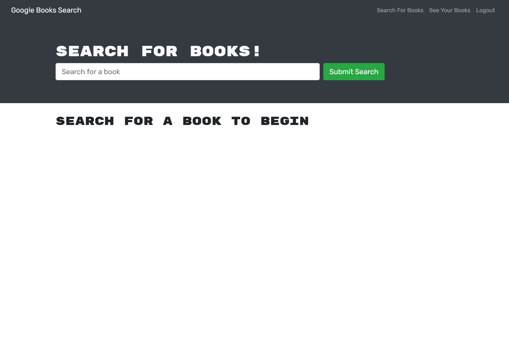
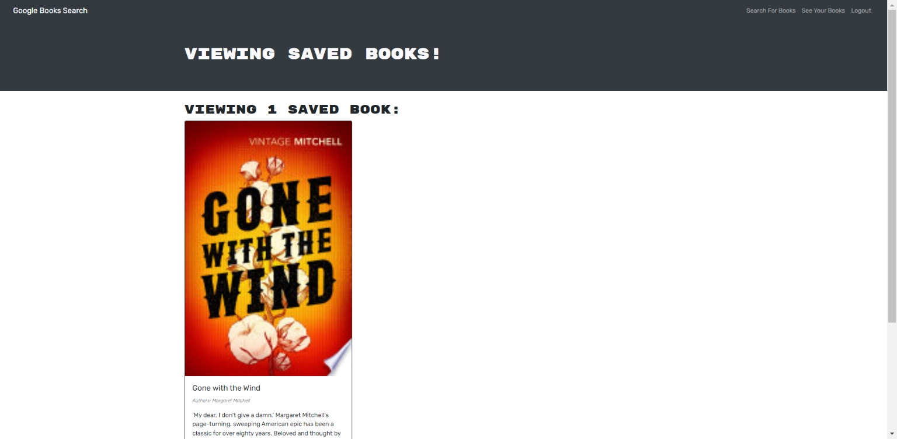

# MOD-21-MERN-BOOK-SEARCH-ENGINE  

## Description

The purpose of this application is to refactor a fully functioning Google Books API search engine from a RESTful API to a GraphQL API built with Apollo Server, using MongoDB database, Node.js/Express.js server on the back-end, a React front end (MERN) and API.  

Output is based on the acceptance criteria outlined in the Module 20 Assignment Overview [Module-21-assignment](https://courses.bootcampspot.com/courses/1181/assignments/23393?module_item_id=467017).

A sample display of expected output is included in the Challenge outline.

## Table of Contents

* [Installation](#installation)
* [Usage](#usage)
* [License](#license)
* [Testing](#testing)
* [Credits](#credits)
* [Questions](#questions)

## Installation

Installation involves the implementation of several npm packages & dependencies, the main ones of which are:

**Server Directory** - launched on localhost:3001 in development

* Apollo Server _apollo-server-express_ npm package - install and integrate to use GraphQL queries and mutuations to fetch and modify data / use _graphql_ package to parse GraphQL syntax in front end & back end.
* JSON Web Tokens - Middleware used for authentication of user credentials; _jsonwebtoken_ package as an alternative to using web-cookies, in conjunction with the _jwt-decode_ npm on the client side with Apollo Client's _setContext_ function to decode the JSON Web Tokens.
* Nodemon package for running and testing the back-end using _npm run watch_ in terminal command line; it automatically restarts the server whenever a change is made in the code and also alerts you to errors.
  
**Client Directory** - launched on localhost:3000 in development

* React - to install, first run npx create-react-app client, remove node-modules and package-lock.json, downgrade react and react-dom to v 17.0.2 for better compatibility, and then run npm install.
* Apollo Client Side Library - install Apollo Client _(@apollo/client)_ as dependency to connect to GraphQL server, along with the _graphql_ dependency for correct GraphQL syntax. An advantage of the apollo/client library is the Hooks that integrate with React for functionality.
* React Router - _npm install react-router-dom_ to enable navigational components that render an SPA to behave more like a multi-page applications

**Root Directory** - install _Concurrently_ package to enable the GraphQL back-end and React front-end to run "concurrently" in the same terminal.  Update _scripts_ in package.json file as seen in package.json file in application's root directory; The __npm run develop_ command will start the server for both server and client side.

## Usage

This application is meant to serve as a book search engine for a Google Books API. A user can enter the name of a book in the input field to conduct a search.  Results include the book's title, author, description, image and link to that book on the Google Books site.  However, the user must be logged in to save a book or delete a book.  

The application features a modal giving a user the option to login; if not yet signed up, the user may click on the signup tab in order to create and account.

Once logged in, menu options available to the user now include options to visit that user's saved books in addition to being able to save or delete a book. The login/signup menu option changes to logout.

## License

This application is covered under the MIT license.  [MIT license link](https://choosealicense.com/licenses/mit/)

## Contributing

Please visit [Contributor Covenant website](https://contributor-covenant.org) for guidance or reach out directly using the contact informtion below.

## Testing

Apollo explorer sandbox [Apollo GraphQL](https://studio.apollographql.com/sandbox/explorer) was used to test the back-end, while the continuous rendering of React as changes are made to the code does enables the developer to measure the impact of each change in the code.

## Credits

Assistance was provided in my weekly tutoring sessions, askBCS sessions, Module-21 lession files and lots of Googling, including the usual visits to the Stack Overflow website [https://stackoverflow.com](https://stackoverflow.com), GitHub [https://Github.com](https://Github.com), React.JS examples and several other Google searches too numerous to name.

## Questions?

If you have any questions, please see my contact details below:

## GitHub Username

My GitHub Username is [github.com/lnd4812](https://github.com/lnd4812)

## GitHub Repository

My GitHub repository link for this project is [github.com/lnd4812/mod-21-mern-book-search-engine](https://github.com/lnd4812/mod-21-mern-book-search-engine)

## Heroku Deployment URL

Heroku deployment URL for application is [https://pacific-harbor-26664.herokuapp.com/](https://pacific-harbor-26664.herokuapp.com/).

## Contact information

To contact me directly, please feel free to drop me an e-mail at: <a hef="mailto:laureldavid64@gmail.com">laureldavid64@gmail.com</a>
